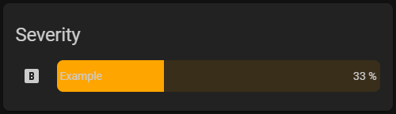
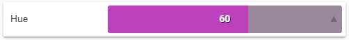

# bar-card


## Description

Bar Card is a customizable animated card for the Home Assistant Lovelace front-end.

### Features
- Automatic animation mode. Starts animating based on value increase or decrease.
- Charge based animation mode. Will show increase based on custom entity state.
- Customizable animation speed and delay.


## Options

| Name | Type | Default | Description
| ---- | ---- | ------- | -----------
| type | string | **Required** | `custom:bar-card`
| entity | string | **Required** | Entity State
| title | string | none | Title displayed next to the bar.
| animation | string | auto | Sets the mode of animation `auto`, `charge`, `off`.
| hue | number | 220 | Changed the color hue of the bar `0`-`360`.
| saturation | string | 50% | Scales saturation of the bar.
| height | string | 40px | Scales the height of the bar.
| width | string | 70% | Scales the width of the bar.
| min | number | 0 | The minimum entity value to be displayed.
| max | number | 100 | The maximum entity value to be displayed.
| speed | number | 2500 | The speed of the bar animation in milliseconds.
| delay | number| 7500 | The amout of time between the bar animation loop in milliseconds.
| from | string | left | Direction of the bar. `left`,`right`
| severity | object | none | A list of severity values.
| border_radius | string | 3px | Amount of corner rounding of the bar.
| charge_entity | string | none | Charge enitity, **required** when using charge animation mode. States can be `on`/`off`, `true`/`false`, `charging`/`discharging`

## Default


```yaml
- type: custom:bar-card
  title: Default
  entity: sensor.default
```
## Severity



```yaml
- type: custom:bar-card
  title: Severity
  entity: sensor.default
  severity:
  - value: 25
    hue: '0'
  - value: 50
    hue: '40'
  - value: 100
    hue: '120'
```
## Hue



```yaml
- type: custom:bar-card
  title: Default
  entity: sensor.default
  hue: 300
```
### Documentation is still under development.

Based on [Big Number Card](https://github.com/ciotlosm/custom-lovelace/tree/master/bignumber-card) by [ciotlosm](https://github.com/ciotlosm).
