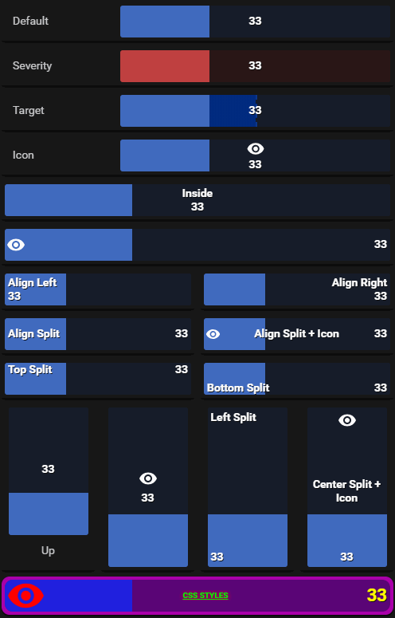
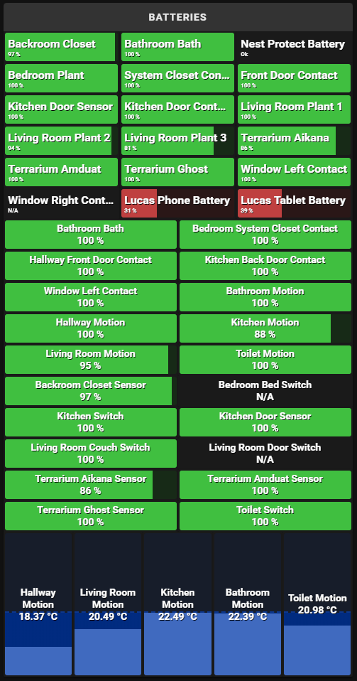

# bar-card



## Description

Bar Card is a customizable animated card for the Home Assistant Lovelace front-end.

### Features
- Customizable bar, text and animation.
- Automatic animation mode. Starts animating based on value increase or decrease.
- Charge based animation mode. Will show increase based on custom entity state.

## Options

| Name | Type | Default | Description
| ---- | ---- | ------- | -----------
| type | string | **Required** | `custom:bar-card`
| entity | string | **Required** | Entity State
| entities | array | none | A list of entities. Cards will share config.
| columns | number | none | Defines the number of columns when using entities list.
| attribute | string | none | Defines the attribute to be displayed.
| unit_of_measurement | string | none | Defines the unit of measurement to be displayed.
| title | string | friendly_name | Title displayed next to the bar.
| title_position | string | left | Position of the title. `left`,`right`,`top`,`bottom`,`inside`,`off`
| show_icon | boolean | false | Defines if icon should be shown.
| icon | string | icon | Defines icon to be displayed. If no icon is defined entity icon attribute will be used. 
| align | string | center | Defines the alignment of text and icon inside the bar. `left`,`right`,`top`,`bottom`,`split`,`center-split`,`left-split`,`right-split`,`top-split`,`bottom-split`
| animation | string | auto | Sets the mode of animation `auto`, `charge`, `off`.
| indicator | string | auto | Sets position off the indicator `auto`,`auto-vertical`,`left`,`right`,`top`,`bottom`,`off`
| hue | number | 220 | Changed the color hue of the bar `0`-`360`.
| saturation | string | 50% | Scales saturation of the bar.
| height | string | 40px | Scales the height of the bar.
| width | string | 70% | Scales the width of the bar.
| padding | string | 4px | Sets padding amount around the card.
| min | number | 0 | The minimum entity value to be displayed. Accepts entity id as value.
| max | number | 100 | The maximum entity value to be displayed. Accepts entity id as value.
| target | number | none | Sets a target marker, must be a value between min and max value. Accepts entity id as value.
| speed | number | 2500 | The speed of the bar animation in milliseconds.
| delay | number| 7500 | The amout of time between the bar animation loop in milliseconds.
| direction | string | right | Direction of the bar. `left`,`right`,`up`,`down`
| severity | object | none | A list of severity values.
| card_style | object | none | A list of CSS styles applied to the card background.
| icon_style | object| none | A list of CSS styles applied to the icon.
| title_style | object | none | A list of CSS styles applied to the title.
| value_style | object | none | A list of CSS styles applied to the entity value.
| charge_entity | string | none | Charge enitity, **required** when using charge animation mode. States can be `on`/`off`, `true`/`false`, `charging`/`discharging`

## Examples

### Default
```yaml
- type: custom:bar-card
  title: Default
  entity: sensor.example
```

### Severity
```yaml
- type: custom:bar-card
  title: Severity
  entity: sensor.example
  severity:
  - value: 33
    hue: '0'
  - value: 66
    hue: '40'
  - value: 100
    hue: '120'
```

### Target
```yaml
- type: custom:bar-card
  entity: sensor.example
  title: Target
  target: 50
```

### Icon
```yaml
- type: custom:bar-card
  entity: sensor.example
  title: Icon
  show_icon: true
  icon: mdi:eye
```

### Title Inside
```yaml
- type: custom:bar-card
  entity: sensor.example
  title: Inside
  title_position: inside
```

### Icon no Title
```yaml
- type: custom:bar-card
  entity: sensor.example
  title_position: 'off'
  show_icon: true
  align: split
  icon: mdi:eye
```

### Align Left
```yaml
- type: custom:bar-card
  entity: sensor.example
  title: Align Left
  title_position: inside
  align: left
```

### Align Right
```yaml
- type: custom:bar-card
  entity: sensor.example
  title: Align Right
  title_position: inside
  align: right
```

### Align Split
```yaml
- type: custom:bar-card
  entity: sensor.example
  title: Align Split
  title_position: inside
  align: split
```

### Align Split + Icon
```yaml
- type: custom:bar-card
  entity: sensor.example
  title: Align Split + Icon
  title_position: inside
  show_icon: true
  icon: mdi:eye
  align: split
```

### Align Top Split
```yaml
- type: custom:bar-card
  entity: sensor.example
  title: Top Split
  title_position: inside
  align: top-split
```

### Align Bottom Split
```yaml
- type: custom:bar-card
  entity: sensor.example
  title: Bottom Split
  title_position: inside
  align: bottom-split
```

### Direction Up
```yaml
- type: custom:bar-card
  height: 160px
  width: 100px
  direction: up
  title: Up
  title_position: bottom
  indicator: auto-vertical
  entity: sensor.example
```

### Up Icon no Title
```yaml
- type: custom:bar-card
  entity: sensor.example
  height: 200px
  width: 100px
  direction: up
  show_icon: true
  icon: mdi:eye
  title_position: 'off'
```

### Up Left Split
```yaml
- type: custom:bar-card
  entity: sensor.example
  height: 200px
  width: 100px
  direction: up
  align: left-split
  title: Left Split
  title_position: inside
```

### Up Center Split
```yaml
- type: custom:bar-card
  entity: sensor.example
  height: 200px
  width: 100px
  direction: up
  show_icon: true
  icon: mdi:eye
  align: center-split
  title: Center Split + Icon
  title_position: inside
```

### CSS Styles
```yaml
- type: custom:bar-card
  entity: sensor.example
  title: CSS Styles
  title_position: inside
  show_icon: true
  icon: mdi:eye
  hue: 240
  saturation: 75%
  align: split
  rounding: 10px
  card_style:
    background: "#AA00AA"
    border-radius: 10px
  icon_style:
    height: 60px
    width: 60px
    color: '#FF0000'
  title_style:
    color: '#00FF00'
    font-size: 10px
    text-transform: uppercase
    text-decoration: underline
    text-shadow: "0 0 10px #FF0000"
  value_style:
    color: '#FFFF00'
    font-size: 22px
```

### Entities + [Auto Entities](https://github.com/thomasloven/lovelace-auto-entities)



```yaml
- type: custom:auto-entities
  card:
    type: custom:bar-card
    severity:
      - value: 50
        hue: '0'
      - value: 75
        hue: '40'
      - value: 100
        hue: '120'
    title_position: inside
    columns: 3
    padding: 2px
    title_style:
      text-align: left
      font-size: 16px
    bar_style:
      align-items: flex-start
      font-size: 8px
  filter:
    include:
      - entity_id: "*_battery"

- type: custom:auto-entities
  card:
    type: custom:bar-card
    attribute: battery
    unit_of_measurement: "%"
    severity:
      - value: 50
        hue: '0'
      - value: 75
        hue: '40'
      - value: 100
        hue: '120'
    title_position: inside
    padding: 2px
    columns: 2
  filter:
    include:
      - attributes:
          battery: "<=100"
    exclude:
      - entity_id: "*_humidity"
      - entity_id: "*_pressure"
      - entity_id: "*_battery"

- type: custom:bar-card
  attribute: temperature
  unit_of_measurement: "°C"
  title_position: inside
  columns: 5
  height: 200px
  min: 15
  max: 32
  target: 22.5
  width: 100%
  padding: 2px
  direction: up
  entities:
    - binary_sensor.motion_hallway
    - binary_sensor.motion_living_room
    - binary_sensor.motion_kitchen
    - binary_sensor.motion_bathroom
    - binary_sensor.motion_toilet
```

## Credits
Inspired by [Big Number Card](https://github.com/ciotlosm/custom-lovelace/tree/master/bignumber-card) by [ciotlosm](https://github.com/ciotlosm).

## Links
[Home Assistant Community Topic](https://community.home-assistant.io/t/lovelace-bar-card/87503)
